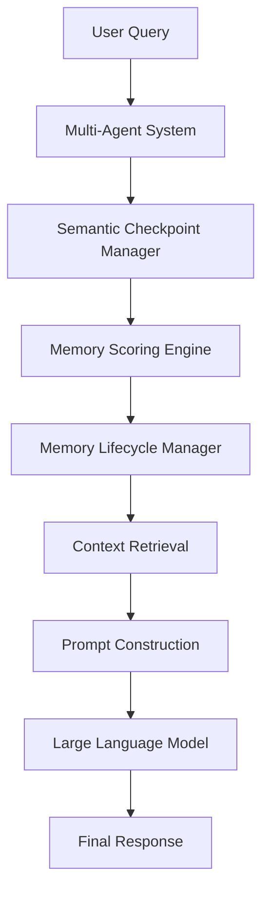

# ASMOS

---

## Adaptive Semantic Memory Orchestration System

ASMOS (Adaptive Semantic Memory Orchestration System) is a multi-agent AI memory framework developed during my AI Research Internship at the Centre for Data Sciences and Applied Machine Learning (CDSAML), PES University.

The framework improves contextual retrieval for LLM-powered multi-agent systems by reducing redundant context while preserving important semantic information.

---

## Problem Statement

Long-running conversations between multiple AI agents repeatedly send complete conversation histories to language models.

This results in:

- High token consumption
- Increased latency
- Redundant context
- Poor scalability

ASMOS addresses this through semantic memory management.

---

## Key Features

## System Architecture

## Results

- Reduced LLM token usage by **23.8%**
- Improved contextual retrieval efficiency
- Reduced redundant context
- Improved memory management

---

## Tech Stack

- Python
- Large Language Models (LLMs)
- Machine Learning
- Natural Language Processing
- Git

---

## My Contributions

- Implemented semantic checkpointing
- Built confidence scoring
- Developed utility-based memory scoring
- Implemented memory lifecycle management
- Wrote automated tests

---

## Note

The implementation was developed during my AI Research Internship and remains in a private repository. This repository documents the project overview, architecture, and my contributions.
